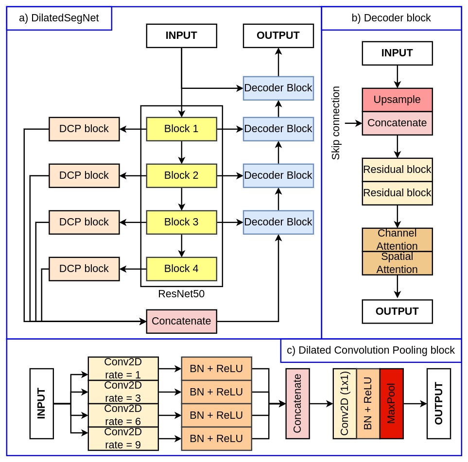
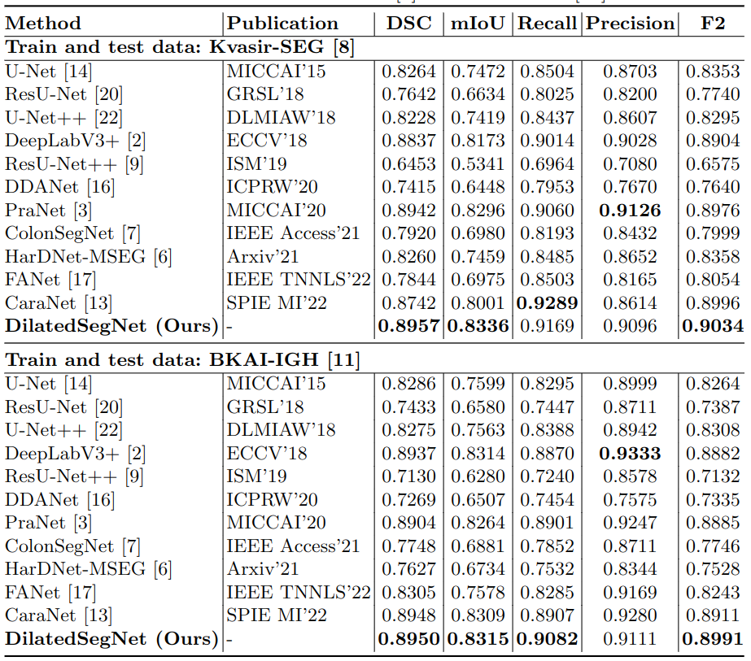
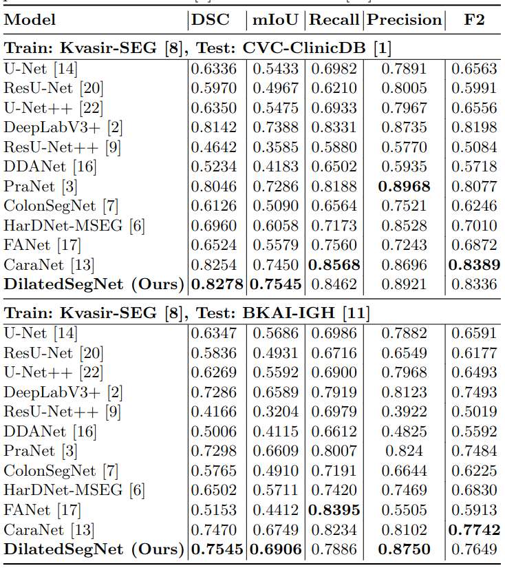
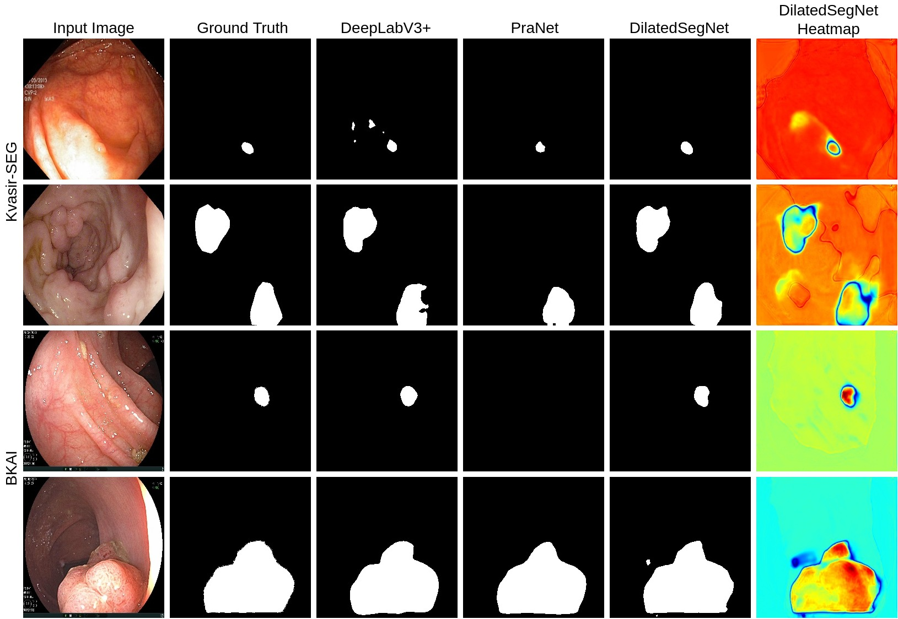

# Polyp Detection

**Live app:** [Frontend](https://harshithreddy01.github.io/Polyp-Frontend/)  
**API:** [Hugging Face Space](https://huggingface.co/spaces/HarshithReddy01/Polyp_Detection)

---

## DilatedSegNet: A Deep Dilated Segmentation Network for Polyp Segmentation

### Abstract

Colorectal cancer (CRC) is the second leading cause of cancer-related death worldwide. Excision of polyps during colonoscopy helps reduce mortality and morbidity for CRC. Powered by deep learning, computer-aided diagnosis (CAD) systems can detect regions in the colon overlooked by physicians during colonoscopy. Lacking high accuracy and real-time speed are the essential obstacles to be overcome for successful clinical integration of such systems. While literature is focused on improving accuracy, the speed parameter is often ignored. Toward this critical need, we developed a novel real-time deep learning-based architecture, **DilatedSegNet**, to perform polyp segmentation on the fly. DilatedSegNet is an encoder-decoder network that uses pre-trained ResNet50 as the encoder from which we extract four levels of feature maps. Each of these feature maps is passed through a dilated convolution pooling (DCP) block. The outputs from the DCP blocks are concatenated and passed through a series of four decoder blocks that predict the segmentation mask. The method achieves a real-time operation speed of **33.68 FPS** with an average **Dice coefficient of 0.90** and **mIoU of 0.83**. Results on the publicly available Kvasir-SEG and BKAI-IGH datasets suggest that DilatedSegNet can give real-time feedback while retaining a high dice coefficient, indicating high potential for use in real clinical settings.

### Architecture

Encoder-decoder with ResNet50 encoder, four levels of feature maps, DCP (dilated convolution pooling) blocks, and four decoder blocks with channel and spatial attention. Two model variants: **Kvasir-SEG** and **BKAI-IGH**.

### Implementation

- **Framework:** PyTorch (1.9.0+), implemented with a single GeForce RTX 3090 GPU (24 GB).
- **Datasets:** [Kvasir-SEG](https://datasets.simula.no/downloads/kvasir-seg.zip), [BKAI-IGH NeoPolyp](https://www.kaggle.com/competitions/bkai-igh-neopolyp/data). Kvasir-SEG split 880/120; BKAI 80:10:10 train/val/test.
- **Weight files (for local run):** [Kvasir-SEG](https://drive.google.com/file/d/1diYckKDMqDWSDD6O5Jm6InCxWEkU0GJC/view?usp=sharing), [BKAI-IGH](https://drive.google.com/file/d/1ojGaQThD56mRhGQaVoJVpAw0oVwSzX8N/view?usp=sharing).

### Results (training)

- **Metrics:** Dice **0.90**, mIoU **0.83**, ~33.68 FPS on GPU.
- Qualitative results and heatmaps show explanation for polyp location, improving trustworthiness of the method.

**Quantitative results (same dataset):**

**Quantitative results (different dataset):**

**Qualitative results:**

### Repo structure

- **Frontend:** React app (this repo root) — upload colonoscopy image, choose model (Kvasir-SEG or BKAI-IGH), view segmentation mask and overlay.
- **Backend:** FastAPI + PyTorch in `/backend` (no weights in repo; see [backend README](backend/README.md) for local run or use the Hugging Face API above).

### License

Source code is free for research and education use only. Any commercial use should receive formal permission from the first author.

### Citation

Updated soon.

### Contact

**Harshith Reddy Nalla**  
- Email: harshithreddynalla01@gmail.com  
- Portfolio: [harshithreddy01.github.io/My-Web](https://harshithreddy01.github.io/My-Web/)

**Debesh Jha**  
- Portfolio: [debeshjha.com](https://debeshjha.com)
